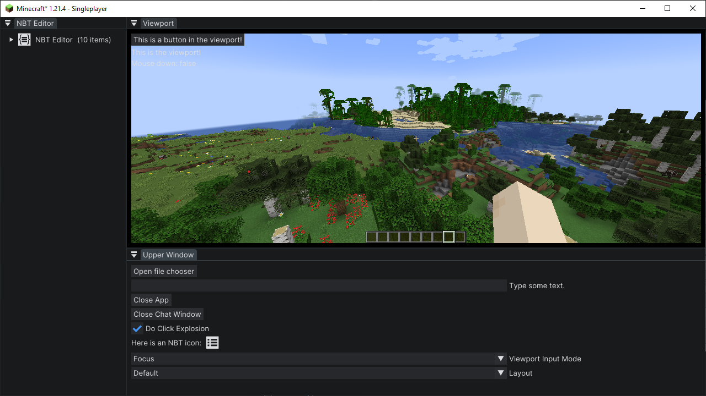
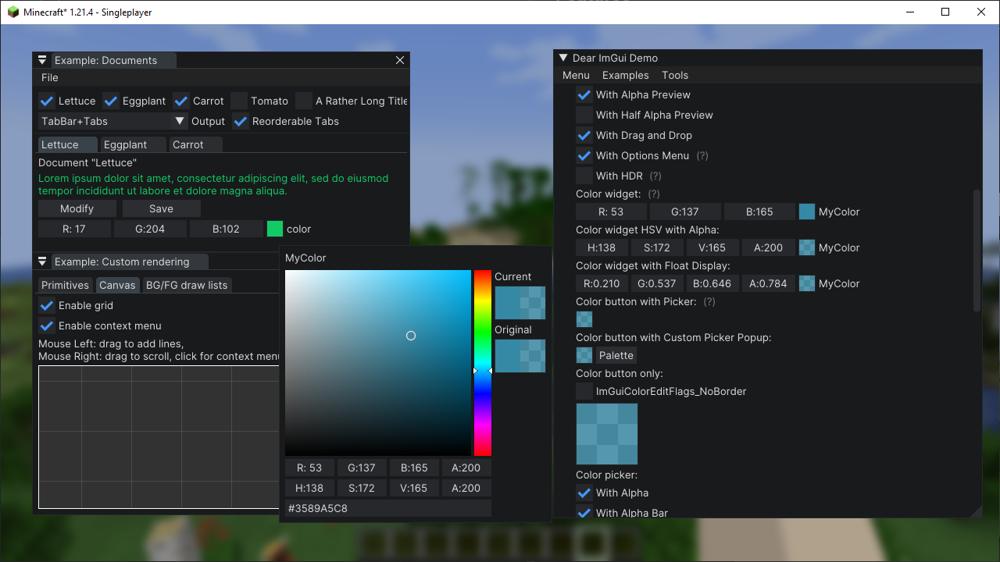

# CraftUI
A framework to use [Dear ImGui](https://github.com/ocornut/imgui) in Minecraft

---

Over the past few years, I've noticed a growing use of ImGui in utility mods such as Flashback. However,
due to technical constraints, none of these mods can be compatible with each other (and if they are, they're extremely jank).

CraftUI is a framework that attempts to fix this. Being a minecraft-specific wrapper for Dear ImGui, it handles mounting
and rendering the ImGui native code, cross-mod compatibility, as well as providing a set of extra, Minecraft-specific utility systems.

> Note: This framework is in active development, and public API functionality might change.
> It also doesn't support all Minecraft versions right now.

## Features

CraftUI is built on [ImGui Java](https://github.com/SpaiR/imgui-java/), and by extension, contains all its features.
On top of that, it also includes:

* Resource-pack-based font loading
* User-definable themes (also resource-pack-based)
* Game viewport resizing via dock-space
* Native file browser access
* Other various utilities

## Examples




## Getting Started

To preface, it's important to have a basic understanding of Dear ImGui, and specifically ImGui Java, before using this library.
Any questions pertaining ImGui on its own will be redirected there.

With that said, to install, add the following to the `repositories` section of your buildscript:

```groovy
repositories {
    // ...
    maven { url = 'https://jitpack.io' }
}
```

Then, in your `dependencies` section, add the following, replacing `[version]` with the desired version:
```groovy
dependencies {
    // ...
    modImplementation 'com.github.Igrium:CraftUI:[version]'
}
```

And don't forget to add it as a dependency in `fabric.mod.json`!

Once you have the framework installed and building, you can create a new UI application by extending `CraftApp`:

```java
public class ExampleApp extends CraftApp {
    @Override
    protected void render(MinecraftClient client) {
        // ImGui rendering code here
    }
}
```

Now, to open the UI, call:
```java
AppManager.openApp(new ExampleApp());
```

The app will now render atop the game until it is closed with `exampleApp.close()`. See `testmod` for a more in-depth example.

## Important Notes:

* Due to the size of the included native libraries, it is *not* recommended to bundle the framework itself with your mod.
* The package `com.igrium.craftui.impl` is *not* considered part of the public API, and could change without warning!