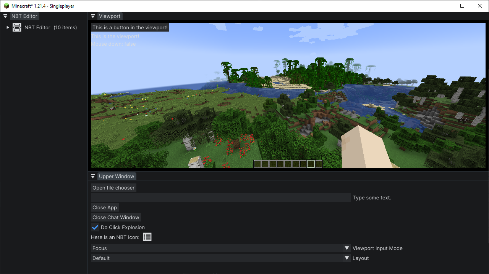
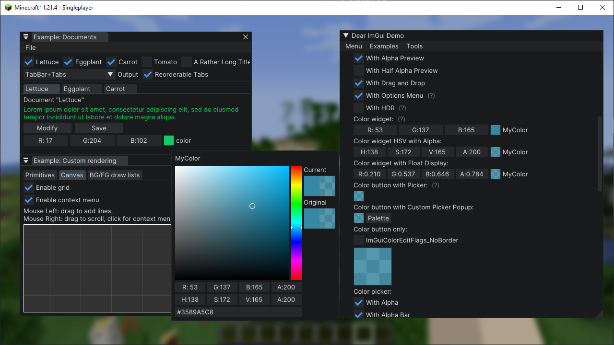

# CraftUI
A Minecraft Application Framework

---

CraftUI is a framework for building fully-featured, desktop applications in Minecraft. It is built upon [Fabric Gui ImGui](https://modrinth.com/mod/fabric-gui-imgui), which itself uses [Dear ImGui](https://github.com/ocornut/imgui). However, while *Fabric Gui ImGui* simply provides bindings to use the library, CraftUI provides a full feature set designed to ease integration with the game,

## Features
In addition to all the features provided natively, CraftUI includes:
* Resource-pack-based styles and font management
* Native file browser access
* Built-in icon font (Font Awesome)
* Unified lifecycle control
* Game viewport resizing
* Premade, Minecraft-specific widgets (nbt editor, etc)
* And more!

## Examples




## Getting Started

To preface, it's important to have a basic understanding of Dear ImGui, and specifically ImGui Java, before using this library.
Any questions pertaining ImGui on its own will be redirected there.

With that said, to install, add the following to the `repositories` section of your buildscript:

```groovy
repositories {
    // ...
    maven { url = 'https://jitpack.io' }
}
```

Then, in your `dependencies` section, add the following, replacing `[version]` with the desired version:
```groovy
dependencies {
    // ...
    modImplementation 'com.github.Igrium:CraftUI:[version]'
}
```

And don't forget to add it as a dependency in `fabric.mod.json`!

Once you have the framework installed and building, you can create a new UI application by extending `CraftApp`:

```java
public class ExampleApp extends CraftApp {
    @Override
    protected void render(Minecraft client) {
        // ImGui rendering code here
    }
}
```

Now, to open the UI, call:
```java
AppManager.openApp(new ExampleApp());
```

The app will now render atop the game until it is closed with `exampleApp.close()`.

Alternatively, you can construct a `CraftAppScreen<>` and pass it your app to draw it as a Screen:
```
Minecraft.getInstance().setScreenAndShow(new CraftAppScreen<>(new ExampleApp()));
```

See `testmod` for a more in-depth example.

## Important Notes:

* Due to the nature of how native libraries are loaded, JIJ-including the library is not supported.
* The package `com.igrium.craftui.impl` is *not* considered part of the public API, and could change without warning!
